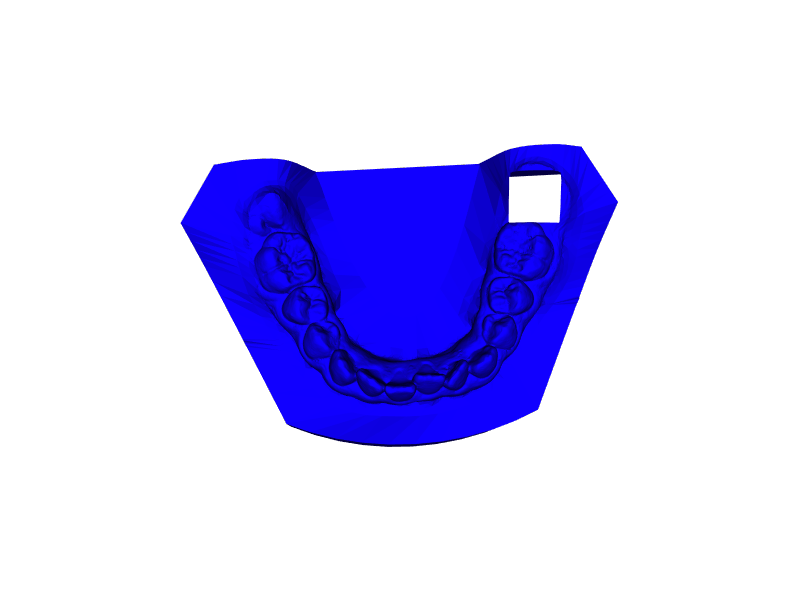

# Tooth Fairy 2.0

Introducing the Tooth Fairy 2.0 Project: Say goodbye to wobbly teeth and awkward tooth-pulling techniques! Our revolutionary dental automation technology guarantees a tooth-rific experience. Just sit back, relax, and watch as your pearly whites bid their farewells to your mouth.

## Project Overview

Project for automating the detection and removal of specific teeth from a 3D dental mesh. You can train your PointNet for identifying how many teeth you would like and then you can remove them from the mesh using the processing module
## Features

- Code for training a PointNet using the 3DTeethSeg Challenge 22 dataset (https://github.com/abenhamadou/3DTeethSeg22_challenge)
- Code for processing a mesh to remove the tooth predicted by the PointNet.

## Getting Started

- Install the requirements.txt
- Train your PointNet using train.py
- Evaluate the results using evaluate.py
- If you would like to see how to predict and remove the desired tooth check remove_tooth.ipynb

## Usage

If you want to see how to use the tooth fairy for removing a Left Mandibular SecondMolar check remove_tooth.ipynb

You can check the **ground truth of a test example**:

The tooth removal using the **ground truth**:

It also includes a section with a **prediction** with a previously trained model on that same example:

And the tooth removal using that prediction:

